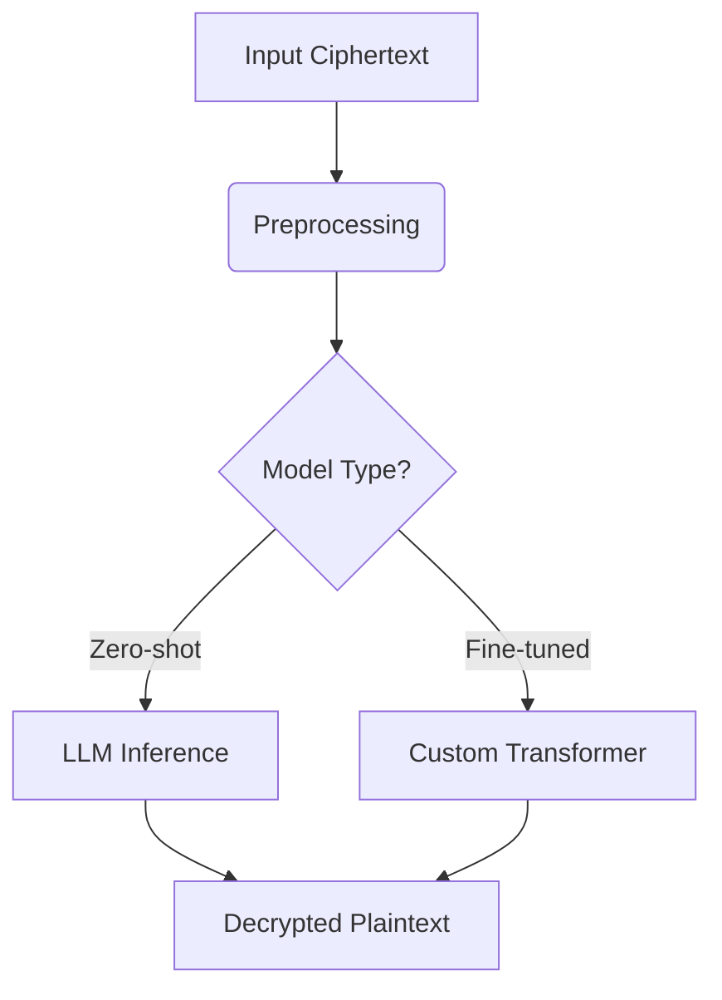

# 🔐 Large Language Models as Cryptanalysts  
**Decrypting Classical Ciphers with AI**  


## 📜 Research Overview  
**Title:** *Large Language Models as Cryptanalysts: Assessing Decryption Capabilities Across Classical Ciphers*  
**Institution:** Department of Electrical and Computer Engineering, American University of Beirut  

### 👥 Authors  
| Name            | Contact                     |  
|-----------------|-----------------------------|  
| Zainab Saad     | zas31@mail.aub.edu          |  
| Hadi Tfaily     | hht08@mail.aub.edu          |  
| Aline Hassan    | afh29@mail.aub.edu          |  

---

## 🎯 Key Objectives  
✔ Evaluate LLM decryption accuracy for classical ciphers  
✔ Compare zero-shot vs. fine-tuned transformer performance  
✔ Develop enhanced positional embedding architectures  
✔ Assess implications for modern cryptographic security  

---

## 🔍 Investigated Ciphers  
| Cipher           | Type          | Challenge Level |  
|------------------|---------------|------------------|  
| **Caesar**       | Substitution  | ★☆☆☆☆            |  
| **Monoalphabetic**| Substitution | ★★☆☆☆            |  
| **Vigenère**     | Polyalphabetic| ★★★☆☆            |  
| **Rail Fence**   | Transposition | ★★☆☆☆            |  

---

## 🏗️ Technical Architecture  


**Core Components:**  
- PyTorch-based transformer models  
- Optuna hyperparameter optimization  
- Mixed-precision (FP16) training  
- Gradient checkpointing for memory efficiency  

---

## ⚙️ Implementation  
### 📦 Dependencies  
```python
pip install torch transformers optuna streamlit gdown
```

### 🚀 Quick Start  
1. Clone repository  
2. Install requirements:  
   ```bash
   pip install -r requirements.txt
   ```  
3. Launch interactive demo:  
   ```bash
   streamlit run test_cmps.py
   ```

---

## 📊 Evaluation Framework  
| Metric               | Measurement Method          |  
|----------------------|-----------------------------|  
| Token-Level Accuracy | Exact match percentage      |  
| Character Accuracy   | Levenshtein distance        |  
| Latency              | Inference time (ms/token)   |  
| Length Robustness    | Accuracy vs. sequence length|  

---

## 📂 Repository Structure  
```
.
├── models/            # Pretrained weights
├── data/              # Training datasets
├── src/               # Core implementations
│   ├── architectures.py
│   ├── utils.py
│   └── ...
├── test_cmps.py   # Interactive demo
├── requirements.txt
└── README.md
```

---

## 📜 Citation  
If referencing this work, please use:  
```bibtex
@misc{llm_cryptanalysis2024,
  title={Large Language Models as Cryptanalysts},
  author={Saad, Zainab and Tfaily, Hadi and Hassan, Aline},
  year={2024},
  institution={American University of Beirut}
}
```

---

